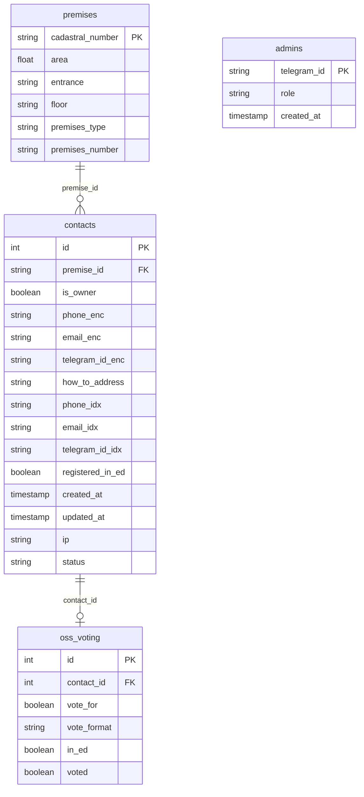

# Итоговая сводка (Action Items)

### 1. TO DO — Вопросы к бизнесу
* **Импорт реестра (CORE-01) и страница загрузки (LOST-02):** Точный формат CSV/XLS (наименования колонок, разделитель, наличие заголовка), список «Ожидаемые колонки» для инструкции и валидации; политика при дубликате кадастрового номера (обновление/пропуск/ошибка).
* **Согласия при ручном вводе (ADM-03):** Как фиксировать согласие на ОПД при добавлении контакта админом (чекбокс «согласие получено при личном контакте» / подпись на бумаге и т.д.).
* **Суперадмин (ADM-04):** Разрешать ли удаление последнего суперадмина и как восстанавливать доступ при потере единственного суперадмина.

### 2. Принятые решения (по SRS 02–06)
* **Реестр анонимен:** ФИО и паспортные данные в реестре и в БД не хранятся; идентификатор помещения — кадастровый номер; контакт — верифицированный канал связи (03, 04).
* **Дедупликация и Blind Index:** Сопоставление контактов при импорте и поиск без расшифровки — по Blind Index (HMAC-SHA256, BE-02). Обязательные поля: phone_idx, email_idx, telegram_id_idx. Нормализация перед хешированием: телефон — только цифры, формат 7XXXXXXXXXX; email — lowercase, без пробелов; telegram_id — строковый формат (03-basic-admin, BE-02).
* **Нормализация номера помещения:** В БД premises_number хранится в нормализованном виде: lowercase, латиница для литер, арабские цифры вместо римских; гарантирует целостность связей при повторных импортах (04, 99 §4).
* **Bootstrap первого админа:** По 03-basic-admin (SR-ADM01-008): INSERT в таблицу admins через SQL при первом развёртывании; детали — в docs/deploy.
* **Rate limit (BE-04):** Лимит по попыткам/час с IP; счётчики в PostgreSQL (Redis не входит в стек) (98-backlog BE-04).

### 3. Сделанные допущения (🤔)
* **Цепочка зависимостей импорта:** CORE-01 зависит от LOST-01 (схема БД) и BE-02 (шифрование ПДн). LOST-02 (Upload Page) — пререквизит по интерфейсу загрузки; CORE-02 (валидация и лимиты) связан с потоком импорта (LOST-02) и имеет повышенный приоритет.
* **Архитектура:** Исходный arch.md описан для другого домена; принят стек React, FastAPI, PostgreSQL, Docker (Auth = Telegram OAuth, Logic = кворум/валидация/импорт).
* **Капча в боте (BOT-02):** Для Telegram-канала капча не требуется; идентификация по telegram_id; rate limit по telegram_id применить.
* **SessionStorage (FE-05):** Не хранить полные ПДн в открытом виде; допущение: маска телефона или флаг «заполнено» для автозаполнения.
* **Синхронизация бот–веб (BOT-04):** «Мгновенно» — доступность при следующем запросе клиента или короткий интервал опроса; WebSocket/SSE не в базовой архитектуре.
* **S3 (OPS-01):** Использование S3-совместимого хранилища в РФ принято как операционное расширение.
* **Uptime-check (OPS-03):** Допущение: два подряд неуспешных проверки перед отправкой уведомления для снижения ложных срабатываний.

### 4. Выявленные риски (⚠️)
* **Хранение ключа шифрования (BE-02):** Мастер-ключ подаётся в контейнер backend исключительно через Docker Secrets или read-only bind mount по пути `/run/secrets/master_key` (03-basic-admin SR-BE02-005). Передача через ENV запрещена; учётная запись СУБД не должна иметь доступа к ключу.
* **Ротация ключей шифрования (BE-02):** Требует процедуры миграции уже зашифрованных данных; документировать и предусмотреть в плане работ.
* **Rate limiting при нескольких инстансах (BE-04):** Счётчики должны храниться в PostgreSQL; при развёртывании без общей БД лимит не общий (98-backlog BE-04).
* **Производительность сложного кворума (CORE-06):** Агрегация «все валидированы и ЗА» может быть тяжёлой на больших домах; индексы и кеш обязательны.
* **Белый список админов (ADM-01, ADM-04):** Первый суперадмин добавляется вручную (Bootstrap по 03); при потере единственного суперадмина процедура восстановления должна быть документирована.

### 5. Схема БД (LOST-01)

Каноническое описание — в [03-basic-admin.md](03-basic-admin.md), раздел LOST-01 «Модель данных». Ниже — сводка таблиц и связей.

**Ключевые допущения модели:**
* Сущность «Собственник» (Owner) **не содержит ФИО**; система не оперирует именами или паспортными данными. Основной объект — **Помещение** (Premise); **Контакт** (Contact) — это верифицированный канал связи (телефон, email, telegram), привязанный к помещению.
* Связь между реестром (импорт) и контактами в БД осуществляется **исключительно через идентификатор помещения** — кадастровый номер (`premise_id`). Номер помещения (`premises_number`) в БД хранится **всегда в нормализованном виде** (lowercase, латиница для литер, арабские цифры вместо римских), что гарантирует целостность связей при повторных импортах.

**Таблицы:**

| Таблица | Назначение | Ключевые поля |
|---------|------------|---------------|
| **admins** | Белый список администраторов | telegram_id, role (administrator \| super_administrator), created_at |
| **premises** | Помещения МКД (реестр) | cadastral_number (PK), площадь, подъезд, этаж, тип_помещения, номер_помещения (String, нормализованный — см. выше) |
| **contacts** | Контакты (каналы связи) | premise_id (FK → premises.cadastral_number), is_owner; ПДн в зашифрованном виде (BE-02): phone, email, telegram_id, **как_обращаться** (единственный способ персонализации рассылок); обязательные технические поля **phone_idx, email_idx, telegram_id_idx** (Blind Index для поиска по зашифрованным ПДн); зарегистрирован_в_электронном_доме (bool), согласия/версия политики, даты, ip, статус (pending / validated / inactive) |
| **голосование_в_ОСС** | Участие в ОСС и голосование | contact_id (FK), позиция_за, формат_голоса, в_электронном_доме, проголосовал (bool) |

**Связи:**

*Примечание:* `голосование_в_ОСС` на диаграмме — `oss_voting`. Поля phone, email, telegram_id и «Обращение» (how_to_address) хранятся в зашифрованном виде (BE-02). Поля `phone_idx`, `email_idx`, `telegram_id_idx` — обязательные Blind Index для поиска без расшифровки. `premise_id` — кадастровый номер помещения (строка, FK на `premises.cadastral_number`).
