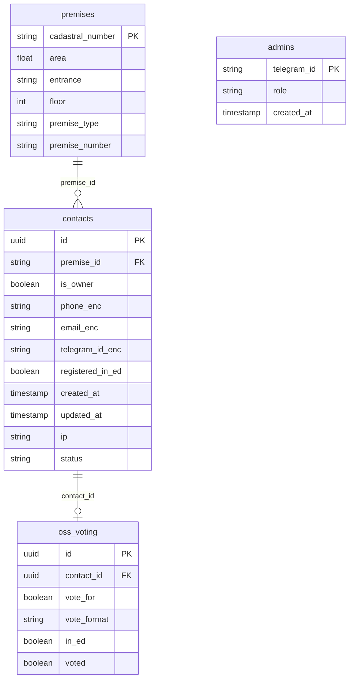

# Итоговая сводка (Action Items)

### 1. TO DO — Вопросы к бизнесу
* **Импорт реестра (CORE-01) и страница загрузки (LOST-02):** Точный формат CSV/XLS (наименования колонок, разделитель, наличие заголовка), список «Ожидаемые колонки» для инструкции и валидации; политика при дубликате кадастрового номера (обновление/пропуск/ошибка).
* **Дедупликация (CORE-02):** Критерий «один контакт на помещение» — разрешать ли несколько контактов (например, два телефона) на одно помещение или строго один активный; при совпадении ключа — только обновление или возможность «добавить ещё».
* **Согласия при ручном вводе (ADM-03):** Как фиксировать согласие на ОПД при добавлении контакта админом (чекбокс «согласие получено при личном контакте» / подпись на бумаге и т.д.).
* **Суперадмин (ADM-04):** Разрешать ли удаление последнего суперадмина и как восстанавливать доступ при потере единственного суперадмина.
* **Порог 60 vs 90 дней (CORE-03):** БТ «60 дней — сособственники», «90 дней — архивация». Подтвердить: при валидации нового через 90 дней старый архивируется; в пределах 60 дней оба считаются сособственниками (не архивировать).

### 2. Сделанные допущения (🤔)
* **Цепочка зависимостей импорта:** CORE-01 зависит от LOST-01 (схема БД) и BE-02 (шифрование ПДн). LOST-02 (Upload Page) — пререквизит по интерфейсу загрузки; CORE-02 (валидация и лимиты) связан с потоком импорта (LOST-02) и имеет повышенный приоритет.
* **Архитектура:** Исходный arch.md описан для другого домена (продукты/баллы); принято использование того же стека (React, FastAPI, PostgreSQL, Docker) с адаптацией модулей под МКД (Auth = Telegram OAuth, Logic = кворум/валидация/импорт; Proxy не используется в текущем виде).
* **Rate limit (BE-04):** Учтены только успешные создания анкет или все попытки — принято: лимит по попыткам/час с IP; при нескольких инстансах backend — требуется общее хранилище (Redis или таблица в БД), иначе лимит не общий.
* **Капча в боте (BOT-02):** Для Telegram-канала капча не требуется; идентификация по telegram_id; rate limit по telegram_id применить.
* **SessionStorage (FE-05):** Не хранить полные ПДн в открытом виде; допущение: маска телефона или флаг «заполнено» для автозаполнения.
* **Синхронизация бот–веб (BOT-04):** «Мгновенно» реализовано как доступность при следующем запросе клиента или короткий интервал опроса; WebSocket/SSE не в базовой архитектуре.
* **S3 (OPS-01):** Использование S3-совместимого хранилища в РФ принято как операционное расширение без изменения бизнес-логики.
* **Uptime-check (OPS-03):** Допущение: два подряд неуспешных проверки перед отправкой уведомления для снижения ложных срабатываний.
* **Ключ шифрования (BE-02):** При отсутствии ключа при старте — рекомендация: отказ старта приложения. Ключ хранится в файле с доступом только у пользователя ОС, под которым запущено приложение; пользователь СУБД не должен иметь доступа к ключу (разделение прав: приложение владеет ключом, БД видит только шифротекст).

### 3. Выявленные риски (⚠️)
* **Rate limiting при нескольких инстансах (BE-04):** In-memory счётчик не общий; при масштабировании backend по горизонтали нужен Redis или общая таблица в PostgreSQL.
* **Ротация ключей шифрования (BE-02):** Требует процедуры миграции уже зашифрованных данных; документировать и предусмотреть в плане работ.
* **Производительность сложного кворума (CORE-06):** Агрегация «все валидированы и ЗА» может быть тяжёлой на больших домах; индексы и кеш обязательны.
* **Конфликт владения 90 дней (CORE-03):** Транзакционная согласованность архивации и валидации; при высокой нагрузке — блокировки; тестирование сценариев с двумя одновременными валидациями по одному помещению.
* **Белый список админов (ADM-01, ADM-04):** Первоначальное наполнение суперадмином — нужен bootstrap (миграция или конфиг при первом развёртывании), чтобы первый суперадмин мог войти.

### 4. Схема БД (LOST-01)

Каноническое описание — в [03-basic-admin.md](03-basic-admin.md), раздел LOST-01 «Модель данных». Ниже — сводка таблиц и связей.

**Таблицы:**

| Таблица | Назначение | Ключевые поля |
|---------|------------|---------------|
| **admins** | Белый список администраторов | telegram_id, role (administrator \| super_administrator), created_at |
| **premises** | Помещения МКД (реестр) | кадастровый_номер (или id), площадь, подъезд, этаж, тип_помещения, номер_помещения (String), общая_площадь_МКД (опц.) |
| **contacts** | Собственники/анкеты | premise_id (FK), is_owner; ПДн в зашифрованном виде (BE-02): phone, email, telegram_id, как_обращаться; зарегистрирован_в_электронном_доме (bool), согласия/версия политики, дата_создания, дата_последнего_изменения (CORE-02), ip, статус (pending / validated / inactive) |
| **голосование_в_ОСС** | Участие в ОСС и голосование | contact_id (FK), позиция_за, формат_голоса, в_электронном_доме, проголосовал (bool) |

**Связи:**

*Примечание:* `голосование_в_ОСС` на диаграмме — `oss_voting`; контактные поля phone/email/telegram_id хранятся в зашифрованном виде (BE-02). `premise_id` — ссылка на помещение (кадастровый_номер или внутренний id помещения), тип по реализации (string или uuid).
